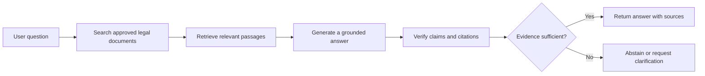

# Closed-Corpus Legal Research Assistant

> [!IMPORTANT]
> **Work in Progress**
>
> This project is under active development and is not production-ready. The flow below represents the system I intend to build; some components may not yet be implemented.

## Goal

Build a legal research assistant that answers questions using only an approved document collection. The system is intended to provide source-backed responses, verify citations, and avoid answering when the available evidence is insufficient.

## Intended Flow

## Design Principles

- Use only documents from the closed corpus.
- Link important claims to supporting passages.
- Clearly separate retrieved evidence from generated text.
- Abstain when the evidence does not support an answer.

## Status

The project is currently in early development. Implementation details, setup instructions, tests, and evaluation results will be added as the system progresses.

## Disclaimer

This project is intended for research and learning purposes. It does not provide legal advice.
