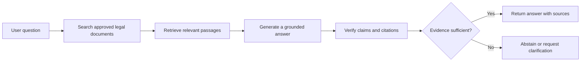

# Closed-Corpus Legal Research Assistant

> [!IMPORTANT]
> **Work in Progress**
>
> This project is under active development and is not production-ready. The flow below represents the system I intend to build; some components may not yet be implemented.

## Goal

Build a legal research assistant that answers questions using only an approved document collection. The system is intended to provide source-backed responses, verify citations, and avoid answering when the available evidence is insufficient.

## Intended Flow


```mermaid
flowchart LR
    A[User question] --> B[Search approved legal documents]
    B --> C[Retrieve relevant passages]
    C --> D[Generate a grounded answer]
    D --> E[Verify claims and citations]
    E --> F{Evidence sufficient?}
    F -- Yes --> G[Return answer with sources]
    F -- No --> H[Abstain or request clarification]
```

## Design Principles

- Use only documents from the closed corpus.
- Link important claims to supporting passages.
- Clearly separate retrieved evidence from generated text.
- Abstain when the evidence does not support an answer.

## Status

The project is currently in early development. Implementation details, setup instructions, tests, and evaluation results will be added as the system progresses.

## Disclaimer

This project is intended for research and learning purposes. It does not provide legal advice.

## Extract a PDF before indexing

From the `legalRAG` directory, install the project dependencies and run:

```bash
python -m pip install -e '.[dev]'
python -m ingestion.pdf_extractor
```

Edit `SOURCE_PATH` and `OUTPUT_PATH` in `legalRAG/ingestion/pdf_extractor.py`
to choose the input and output. Defaults are `legalRAG/documents/source.pdf`
and `legalRAG/documents/source.txt`, independent of the working directory.
Extraction uses PyMuPDF.

The output is UTF-8 text with `[PAGE 1]`, `[PAGE 2]`, etc. based on physical
PDF page order, including blank pages. The output parent directory must exist;
existing files are not overwritten. Extraction finishes before output is written.

This step does not run indexing or infer Markdown/legal section headings.
Encrypted PDFs and documents with neither extractable text nor raster images
are rejected. Images no longer block extraction or require approval. A warning
reports the count and physical page numbers of image-only pages (raster images
present, no non-whitespace extracted text). Identical images are grouped by
PyMuPDF's image digest, with their page locations listed once per group.

Every page keeps its `[PAGE N]` marker. Mixed text/image pages retain their native
text; image-only pages contain just the marker and a blank line. Even an entirely
image-only PDF produces marked output, but has no text for the indexer to index.
Blank pages are not counted as image-only. Flags are console/Python warnings,
not inserted into source text. OCR is not performed; vector drawings are not
covered by this raster-image check. A readable footer does not mean the image
content was extracted. Printed footer numbers remain source text.

## Search the indexed document

With Ollama running and the indexed data available, run from `legalRAG`:

```bash
python -m retrieval.run_retriever
```

Edit `QUESTION` and `DATA_DIR` in `retrieval/run_retriever.py`. The default data
location matches the current indexer: `legalRAG/ingestion/data/`. The runner
uses Chroma collection `indexer_test` and the same `embeddinggemma` model used
for indexing. It refuses to silently create an empty corpus if files are missing.

Opening `VersionedStore` creates/backfills an FTS5 index over searchable passage
text and heading paths. New passages are indexed in the same SQLite transaction.
No re-embedding is required. Queries use quoted literal terms joined with OR,
ranked by SQLite BM25. Both keyword and semantic search are restricted to the
same latest stored version per document before applying candidate limits.
"Latest" means highest ingestion version number, not legally applicable as of
a date; effective-date filtering is not implemented yet.

Results merge by passage ID and use reciprocal rank fusion with k=60:
`sum(1 / (60 + channel_rank))`. Higher scores rank first; these scores are not
cosine similarities or confidence values. Ties break by passage ID. The runner
prints source pages and origins (`vector`, `keyword`, or `vector+keyword`).
The former unversioned SQLiteStore remains separate; HybridRetriever now expects
VersionedStore. Graph retrieval, model reranking, and answer generation remain
future steps. For this small local corpus, eligible passage IDs are materialized
in memory and passed to Chroma as an ID filter.
