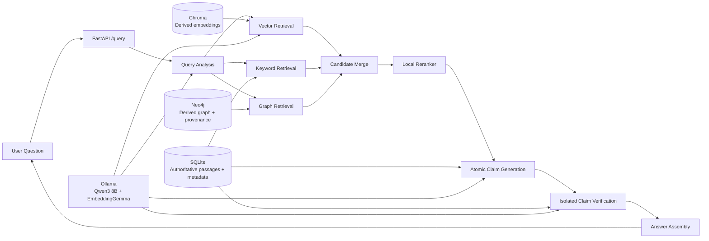
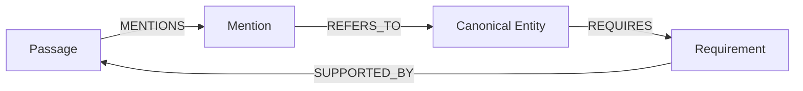
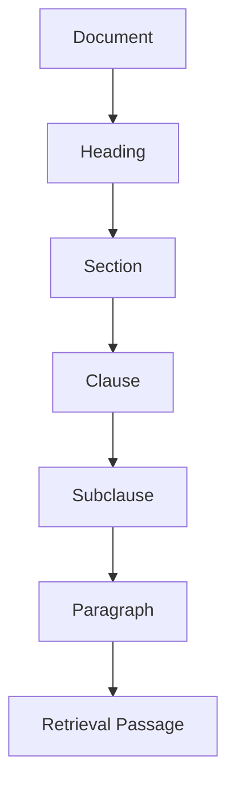
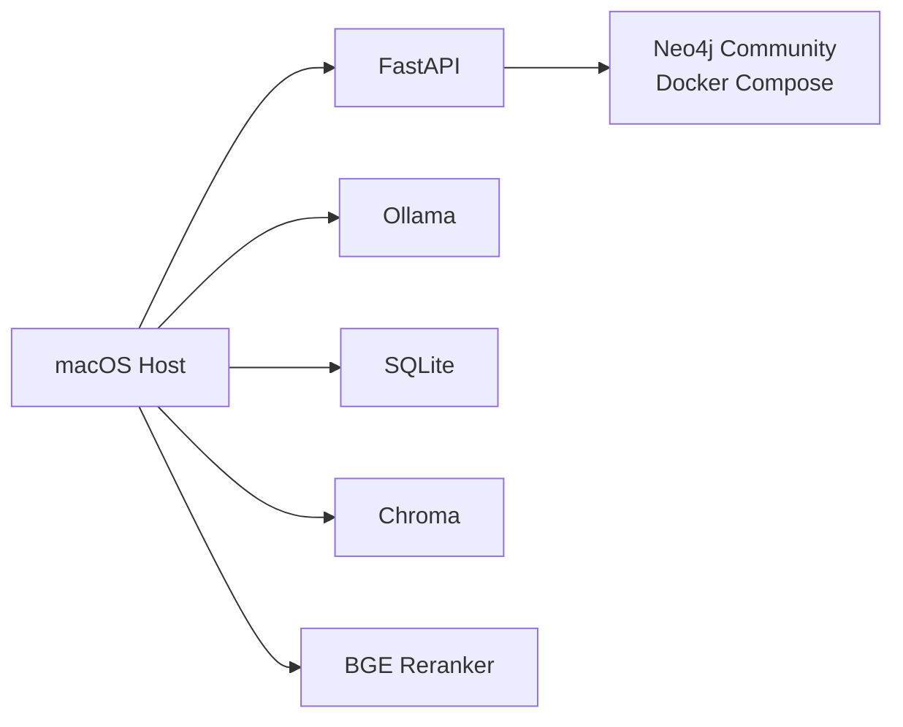

# Legal GraphRAG Blueprint

## 1. Product Goal

Build a local, closed-corpus legal research assistant for society-led
self-redevelopment by cooperative housing societies in Maharashtra, with
particular practical relevance to Mumbai.

The assistant uses a graph to improve retrieval, but the graph is never legal
evidence. Every displayed legal claim must be supported by validated passages
from supplied source documents. When the indexed corpus does not establish an
answer, the assistant abstains.

## 2. Core Safety Invariants

These rules are system boundaries, not prompt suggestions:

1. The model may use pretrained knowledge only to interpret or rewrite a user's
   question.
2. Every legal claim must cite one or more indexed source passages.
3. Every graph fact must link to an exact supporting span in a source passage.
4. Graph facts without a valid source span are rejected before persistence.
5. Answers cite source passages, never graph nodes or relationships.
6. Every generated claim is verified in an isolated model pass.
7. Only claims verified as `SUPPORTED` may be displayed.
8. Missing support produces `UNSUPPORTED_BY_CORPUS`, not a best-effort answer.
9. Unresolved source conflicts produce `CONFLICTING_SOURCES`, not an inferred
   legal conclusion.
10. Earlier chatbot answers never become evidence for later answers.

## 3. Initial Scope

### Included

- Research questions about society-led self-redevelopment
- Closed-corpus answers from supplied documents
- One manually extracted legal document with page markers
- Hierarchical legal passage segmentation
- SQLite passage and metadata persistence
- Chroma semantic retrieval
- SQLite full-text keyword retrieval
- Neo4j graph extraction and traversal
- Local reranking
- Cited atomic answer claims
- Separate-pass claim verification
- Abstention, conflict handling, and retrieval evidence traces
- FastAPI research query endpoint

### Deferred

- PDF parsing and upload workflow
- Streamlit user interface
- Compliance mode
- Durable and asynchronous ingestion jobs
- OCR and scanned-document support
- Document review and drafting
- Approval and quarantine workflows
- Authored evaluation suite
- Web search and external tool calls

## 4. Runtime Architecture



### Persistence Responsibilities

| Store | Responsibility | Rebuildable |
|---|---|---|
| SQLite | Authoritative document metadata, versions, passage text, hierarchy, offsets, prompt/model records, and query traces | No |
| Chroma | Passage embeddings keyed by stable passage ID | Yes, from SQLite |
| Neo4j | Derived entities, mentions, relationships, and provenance paths | Yes, from SQLite |
| Original files | Immutable supplied source documents | No |

SQLite is the source of truth. A Chroma document payload may contain duplicated
passage text for convenience, but it is never authoritative.

## 5. Local Model Allocation

| Task | Initial Model | Runtime |
|---|---|---|
| Query interpretation and rewriting | Quantized Qwen3 8B | Ollama |
| Graph extraction | Quantized Qwen3 8B | Ollama |
| Answer generation | Quantized Qwen3 8B | Ollama |
| Claim verification | Quantized Qwen3 8B in a fresh context | Ollama |
| Embeddings | `embeddinggemma` | Ollama |
| Candidate reranking | `BAAI/bge-reranker-v2-m3` | Local Python |

All model identifiers, timeouts, and batch sizes must be configurable. The
target device is an Apple M4 with 16 GB unified memory, so only one expensive
model stage should run at a time.

## 6. Stable Identifiers

Identifiers must be deterministic and independent of Chroma or Neo4j internal
IDs.

```text
document_id       = UUID assigned to a logical document
document_version_id = UUID assigned to an immutable version
passage_id        = SHA-256(document_version_id + passage_kind + start_offset + end_offset)
mention_id        = SHA-256(passage_id + node_type + span_start + span_end)
entity_id         = SHA-256(node_type + canonical_name)
relationship_id   = SHA-256(source_entity_id + type + target_entity_id + passage_id + span)
query_id          = UUID assigned per query turn
```

## 7. SQLite Data Model

The first implementation may use SQLAlchemy, but the schema must remain plain
SQLite and inspectable.

### `documents`

| Column | Type | Notes |
|---|---|---|
| `id` | TEXT PK | Logical document ID |
| `title` | TEXT NOT NULL | Uploader-supplied |
| `document_type` | TEXT NOT NULL | Controlled value |
| `issuing_authority` | TEXT NOT NULL | Uploader-supplied |
| `jurisdiction` | TEXT NOT NULL | Initial default: Maharashtra, India |
| `official_identifier` | TEXT NULL | Notification/order/document number |
| `source_url` | TEXT NULL | Informational only |
| `created_at` | TEXT NOT NULL | ISO-8601 |

### `document_versions`

| Column | Type | Notes |
|---|---|---|
| `id` | TEXT PK | Immutable version ID |
| `document_id` | TEXT FK | Parent document |
| `version_number` | INTEGER NOT NULL | Monotonic per document |
| `sha256` | TEXT UNIQUE NOT NULL | Reject exact duplicates |
| `publication_date` | TEXT NOT NULL | ISO date |
| `effective_from` | TEXT NULL | ISO date |
| `effective_until` | TEXT NULL | ISO date |
| `page_count` | INTEGER NOT NULL | From source |
| `source_path` | TEXT NOT NULL | Immutable original |
| `ingested_at` | TEXT NOT NULL | ISO-8601 |
| `is_latest` | INTEGER NOT NULL | One latest version per document |

### `passages`

| Column | Type | Notes |
|---|---|---|
| `id` | TEXT PK | Stable passage ID |
| `document_version_id` | TEXT FK | Source version |
| `parent_id` | TEXT FK NULL | Hierarchical parent passage |
| `kind` | TEXT NOT NULL | `DOCUMENT`, `HEADING`, `SECTION`, `CLAUSE`, `SUBCLAUSE`, `PARAGRAPH`, `RETRIEVAL` |
| `ordinal` | INTEGER NOT NULL | Stable sibling order |
| `heading_path` | TEXT NOT NULL | JSON array |
| `text` | TEXT NOT NULL | Exact source-derived text |
| `page_start` | INTEGER NOT NULL | Citation boundary |
| `page_end` | INTEGER NOT NULL | Citation boundary |
| `char_start` | INTEGER NOT NULL | Offset in normalized version text |
| `char_end` | INTEGER NOT NULL | Exclusive offset |
| `is_retrievable` | INTEGER NOT NULL | Only retrieval passages enter search |

Create an SQLite FTS5 virtual table over retrievable passage text and heading
paths for keyword search.

### `model_runs`

| Column | Type | Notes |
|---|---|---|
| `id` | TEXT PK | Run ID |
| `stage` | TEXT NOT NULL | Extraction, classification, generation, verification |
| `model_name` | TEXT NOT NULL | Exact model identifier |
| `prompt_version` | TEXT NOT NULL | Versioned prompt identifier |
| `schema_version` | TEXT NOT NULL | Versioned Pydantic schema identifier |
| `status` | TEXT NOT NULL | `SUCCEEDED` or `FAILED` |
| `error` | TEXT NULL | Validation or runtime failure |
| `created_at` | TEXT NOT NULL | ISO-8601 |

### `query_traces`

Store query classification, standalone rewritten query, applicable date,
retrieval candidates, retrieval origins, graph paths, reranker scores, generated
claims, verification results, timings, and final outcome. This makes the
Retrieval Evidence panel possible later.

## 8. Neo4j Graph Model

### Allowed Node Labels

`Document`, `Passage`, `Authority`, `Provision`, `Actor`, `Action`,
`Requirement`, `Evidence`, `Deadline`, `Condition`, `Exception`, `Consequence`,
and `LegalConcept`.

### Allowed Extracted Relationship Types

`CONTAINS`, `MENTIONS`, `REQUIRES`, `PERFORMED_BY`, `SUPPORTED_BY`,
`TRIGGERED_BY`, `HAS_DEADLINE`, `NEEDS_EVIDENCE`, `HAS_EXCEPTION`,
`NONCOMPLIANCE_CAUSES`, `AMENDS`, `SUPERSEDES`, `CITES`, and `RELATES_TO`.

The persistence layer may create deterministic structural relationships such as
`REFERS_TO` between a preserved mention and its canonical entity. These are not
LLM-extracted legal relationships and do not expand the allowed extraction
schema.

### Required Provenance Properties

Every extracted node mention and extracted relationship must include:

```text
passage_id
document_version_id
supporting_text
span_start
span_end
page_start
page_end
extractor_model
prompt_version
```

Do not store model-reported confidence.

### Mention and Entity Pattern



`Mention` is an implementation label needed to preserve exact source language.
Canonical entities are created through deterministic normalization and explicit
aliases. The LLM may propose aliases but cannot merge entities.

### Graph Extraction Validation

For each proposed node or relationship:

1. Validate its type against the allowed schema.
2. Validate both relationship endpoints exist.
3. Validate `supporting_text` occurs verbatim in the target passage.
4. Validate span offsets exactly select `supporting_text`.
5. Validate page numbers match the target passage.
6. Canonicalize mentions deterministically.
7. Persist only after all checks pass.

## 9. Hierarchical Passage Model

The existing fixed-size overlapping chunker will be replaced.



Rules:

- Deterministic layout and numbering rules own boundaries.
- Retrieval passages do not overlap.
- Oversized provisions split into child retrieval passages.
- Every child retains parent IDs and the complete heading path.
- Embedding input contains heading path plus retrieval-passage text.
- Adjacent passages are linked by stable sibling order.
- Model classification may assist ambiguous headings but may not invent passage
  boundaries.

### Extraction Context Window

Each graph-extraction call receives:

- Target retrieval passage
- Complete parent provision
- Ancestor heading path
- Previous and next sibling retrieval passages
- Document metadata

Only exact spans from the target retrieval passage may support persisted facts.

## 10. Structured Model Contracts

Every model call uses a versioned prompt, a versioned Pydantic schema, and
Ollama JSON-schema-constrained output. Invalid output receives one retry with
validation errors; a second failure ends that stage explicitly.

### Query Analysis

```python
class QueryAnalysis(BaseModel):
    mode: Literal["RESEARCH", "COMPLIANCE", "OUT_OF_SCOPE"]
    standalone_query: str
    applicable_date: date | None
    entities: list[str]
    legal_concepts: list[str]
    relationship_types: list[AllowedRelationship]
```

For the first milestone, only `RESEARCH` is executed. `COMPLIANCE` returns a
clear deferred-feature response.

### Graph Extraction

```python
class ExtractedMention(BaseModel):
    node_type: AllowedNodeType
    name: str
    supporting_text: str
    span_start: int
    span_end: int

class ExtractedRelationship(BaseModel):
    source_mention_index: int
    relationship_type: AllowedRelationship
    target_mention_index: int
    supporting_text: str
    span_start: int
    span_end: int

class GraphExtraction(BaseModel):
    mentions: list[ExtractedMention]
    relationships: list[ExtractedRelationship]
```

### Answer Generation

```python
class GeneratedClaim(BaseModel):
    text: str
    passage_ids: list[str]
    synthesis: bool

class GeneratedAnswer(BaseModel):
    claims: list[GeneratedClaim]
    assumptions: list[str]
    limitations: list[str]
```

### Claim Verification

```python
class ClaimVerification(BaseModel):
    status: Literal["SUPPORTED", "CONTRADICTED", "NOT_ESTABLISHED"]
    supporting_spans: list[str]
    explanation: str
```

The verifier receives only one claim and its cited passages in a fresh context.
Every returned supporting span must occur verbatim in a cited passage.

## 11. Research Query Pipeline

### Request

```json
{
  "question": "What approval is required before obtaining project finance?",
  "mode": "RESEARCH",
  "applicable_date": null,
  "conversation_id": null
}
```

### Stages

1. **Classify and rewrite**
   - Convert follow-ups to a standalone query.
   - Extract likely entities, concepts, and relevant relationship types.
   - Pretrained knowledge may be used only in this stage.

2. **Filter corpus**
   - Default to latest document versions.
   - If an applicable date is present, select versions valid on that date.
   - If validity cannot be established, retain passages but mark the limitation.

3. **Retrieve in parallel**
   - Chroma vector search using EmbeddingGemma.
   - SQLite FTS5 keyword search.
   - Neo4j graph expansion up to configurable `3` hops.
   - Prior verified passages may receive a follow-up boost.

4. **Merge and deduplicate**
   - Merge candidates by passage ID.
   - Preserve all retrieval origins and graph paths.
   - Apply per-channel and global candidate caps.

5. **Rerank**
   - Rerank query-passage pairs with BGE reranker.
   - Load complete parent context only for final selected passages.

6. **Generate atomic claims**
   - Use only selected source passages.
   - Require passage IDs for every claim.
   - Do not allow a prose answer outside the structured schema.

7. **Validate citations deterministically**
   - Reject unknown or duplicate passage IDs.
   - Reject citations excluded by version or applicable-date filtering.
   - Reject unsupported exact quotations.

8. **Verify claims**
   - Verify claims in isolated passes, batched where possible.
   - Remove `CONTRADICTED` and `NOT_ESTABLISHED` claims.
   - Detect incompatible supported claims.

9. **Resolve outcome**
   - `ANSWERED`: at least one supported claim answers the question.
   - `UNSUPPORTED_BY_CORPUS`: no supported claim answers the question.
   - `CONFLICTING_SOURCES`: supported claims conflict and metadata cannot
     deterministically establish precedence.
   - `OUT_OF_SCOPE`: question is outside product scope.

10. **Assemble response and trace**
    - Format answer, assumptions, sources, and limitations.
    - Persist timing, retrieval, graph, reranking, and verification trace.

## 12. API Contract

### `POST /query`

Initial request fields:

```text
question: required string
mode: optional RESEARCH | COMPLIANCE
applicable_date: optional ISO date
conversation_id: optional string
```

Initial response shape:

```python
class Citation(BaseModel):
    passage_id: str
    document_title: str
    document_version: int
    section_path: list[str]
    page_start: int
    page_end: int
    excerpt: str

class AnswerClaim(BaseModel):
    text: str
    citation_ids: list[int]
    synthesis: bool

class QueryResponse(BaseModel):
    query_id: str
    outcome: Literal[
        "ANSWERED",
        "UNSUPPORTED_BY_CORPUS",
        "CONFLICTING_SOURCES",
        "OUT_OF_SCOPE",
    ]
    claims: list[AnswerClaim]
    assumptions: list[str]
    citations: list[Citation]
    limitations: list[str]
    elapsed_ms: int
```

### `GET /query/{query_id}/trace`

Returns retrieval origins, graph paths, reranker scores, selected passages,
claim-verification results, and stage timings. It must not expose hidden chain of
thought; explanations are limited to structured inputs, outputs, and validation
results.

### Deferred Endpoints

- Document upload and metadata endpoints
- Ingestion status endpoints
- Compliance-specific endpoints

## 13. Suggested Module Boundaries

```text
legalRAG/
├── api/
│   ├── app.py
│   └── routes/
│       └── query.py
├── config.py
├── domain/
│   ├── enums.py
│   ├── documents.py
│   ├── passages.py
│   ├── graph.py
│   ├── queries.py
│   └── answers.py
├── persistence/
│   ├── sqlite.py
│   ├── chroma.py
│   └── neo4j.py
├── ingestion/
│   ├── page_markers.py
│   ├── hierarchy.py
│   ├── embeddings.py
│   ├── extraction.py
│   └── index_document.py
├── retrieval/
│   ├── vector.py
│   ├── keyword.py
│   ├── graph.py
│   ├── merge.py
│   └── rerank.py
├── answering/
│   ├── analyze_query.py
│   ├── generate_claims.py
│   ├── verify_claims.py
│   ├── conflicts.py
│   └── assemble.py
├── llm/
│   ├── ollama.py
│   ├── structured.py
│   └── prompts/
└── tracing/
    └── query_trace.py
```

The existing `chunking.py`, `embedding.py`, and `indexing.py` are prototypes.
Their behavior should be migrated into these modules rather than extended as
the production architecture.

## 14. Configuration

Use environment-backed settings with conservative defaults:

```text
MAIN_MODEL=qwen3:8b
EMBEDDING_MODEL=embeddinggemma
RERANKER_MODEL=BAAI/bge-reranker-v2-m3
GRAPH_MAX_HOPS=3
VECTOR_CANDIDATE_LIMIT=20
KEYWORD_CANDIDATE_LIMIT=20
GRAPH_CANDIDATE_LIMIT=30
RERANK_LIMIT=8
ANSWER_TIMEOUT_SECONDS=45
OLLAMA_BASE_URL=http://localhost:11434
NEO4J_URI=bolt://localhost:7687
SQLITE_PATH=./data/legal_rag.sqlite3
CHROMA_PATH=./data/chroma
```

Candidate limits are starting points, not quality conclusions.

## 15. Local Deployment

Docker Compose initially runs only Neo4j Community Edition. FastAPI, Ollama,
Chroma, SQLite, and the reranker run directly on the host to make Apple Silicon
model acceleration straightforward.



## 16. Performance Budget

Target maximum end-to-end query latency: **45 seconds**.

Suggested budget:

| Stage | Target |
|---|---:|
| Query analysis | 4 s |
| Hybrid retrieval | 3 s |
| Reranking | 5 s |
| Claim generation | 14 s |
| Claim verification | 17 s |
| Assembly and persistence | 2 s |

Verification should batch claims where structured output remains dependable.
Cache embeddings, graph neighborhoods, retrieval candidates, and verified
claim-passage pairs without treating cached answers as evidence.

## 17. First Implementation Milestone

The first milestone is complete when:

1. One manually extracted source document with page markers is loaded.
2. Hierarchical passages and metadata exist in SQLite.
3. Retrieval passages are embedded in Chroma using EmbeddingGemma.
4. A constrained, provenance-grounded graph exists in Neo4j.
5. `POST /query` accepts one research question.
6. Vector, keyword, and three-hop graph retrieval all contribute traceable
   candidates.
7. The reranker selects source passages.
8. The main model generates atomic cited claims.
9. A separate pass verifies each displayed claim.
10. The API returns `ANSWERED`, `UNSUPPORTED_BY_CORPUS`,
    `CONFLICTING_SOURCES`, or `OUT_OF_SCOPE`.
11. `GET /query/{query_id}/trace` explains retrieval and verification outcomes.
12. The complete request remains within the 45-second target on the M4 device,
    or the trace clearly identifies the stage exceeding its budget.

## 18. Phased Build Plan

### Phase 1: Foundations

- Create Python project structure and dependencies.
- Add typed configuration and domain schemas.
- Add SQLite schema and migrations.
- Add Neo4j Docker Compose service and constraints.
- Add Ollama structured-output client.

### Phase 2: Manual Document Indexing

- Replace overlapping chunking with deterministic hierarchical segmentation.
- Persist one page-marked document and passage hierarchy in SQLite.
- Embed retrievable passages into Chroma.
- Extract and validate constrained graph facts into Neo4j.

### Phase 3: Hybrid Retrieval

- Implement SQLite FTS5 keyword retrieval.
- Implement Chroma vector retrieval.
- Implement configurable three-hop Neo4j retrieval.
- Merge, deduplicate, rerank, and persist retrieval traces.

### Phase 4: Cited Research Answers

- Implement query analysis and scope classification.
- Implement atomic claim generation.
- Implement deterministic citation validation.
- Implement isolated claim verification.
- Implement conflict detection, abstention, answer assembly, and FastAPI routes.

### Phase 5: Deferred Product Features

- Native-text PDF ingestion
- Durable asynchronous ingestion jobs
- Streamlit interface
- Compliance mode
- Authored evaluation suite and retrieval benchmarking

## 19. Known Risks

| Risk | Current Mitigation |
|---|---|
| Main model repeats the same error during verification | Fresh isolated verification context, exact-span checks, reject uncertainty |
| Graph extraction misses or invents relationships | Restricted schema, target-passage grounding, deterministic validation |
| Three-hop traversal introduces noise | Relationship filtering, candidate caps, reranking |
| Source metadata is incomplete or incorrect | Disclose limitations and unresolved conflicts; never infer precedence |
| Deferred evaluation hides regressions | Persist rich traces now; add authored suite before relying on the system |
| All supplied documents are immediately trusted | Closed-corpus citations expose sources; approval workflow remains deferred |
| One PDF contains several documents | Disclose one-PDF-one-document assumption |
| Local model and databases exceed memory | Sequential expensive stages and configurable candidate limits |

## 20. Definition of Trustworthy Behavior

The assistant is not trustworthy because it sounds cautious. It is trustworthy
only when a user or developer can trace every displayed legal claim through:

```text
Displayed claim
→ verification result
→ cited passage ID
→ exact source text and page
→ immutable document version
```

Graph paths, embeddings, reranker scores, and model explanations help retrieve
and inspect evidence, but none of them substitute for that chain.
